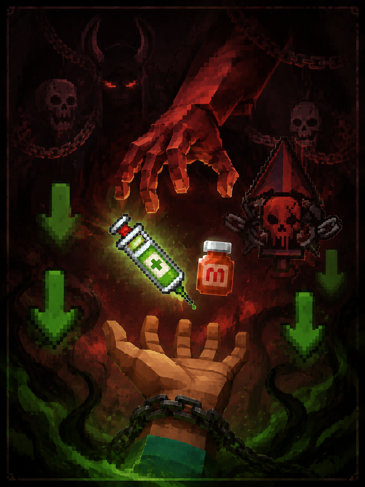

# First Aid New

First Aid New is a multi-loader port of ichttt’s classic **First Aid**, rebuilt for modern Minecraft. It replaces the single vanilla health bar with per-body-part damage, injury debuffs, timed medicine, unconsciousness and rescue, and a full client feedback layer—pain, suppression, heartbeat audio, and HUD overlays that make survival feel physical again.

Original project: [First Aid on CurseForge](https://www.curseforge.com/minecraft/mc-mods/first-aid)

---

## 1.3.0 — *Deal with the Devil*



*Mercy has a meter. Every dose writes itself onto the glass of the screen.*

**1.3.0** introduces a more immersive HUD feedback system that makes the screen feel like a nervous system. It builds on previous morphine and addiction features with enhanced visual effects, graded pain and suppression, and refined integration across the board.

### Key new features in 1.3.0 compared to previous versions

- **Dynamic morphine saturation and graded suppression**: Morphine saturation now fades smoothly with remaining duration; suppression provides stronger, tiered desaturation and blur effects that scale clearly between mild, medium, and high pressure.
- **Advanced post-processing**: Composite pain/color processing with radial blur, continuous gray-white suppression rim/edge wash, and hit-frequency red pulse vignette.
- **Seamless adrenaline integration**: Adrenaline rush blur now locks to moderate pain strength even under painkillers for better combat feedback.
- **Improved morphine-milk interaction**: Milk fully and cleanly clears morphine model state without leftovers.
- **Recipe update**: The Morphine Injector now requires two Morphine (in addition to iron, redstone, and a glass bottle).

### Supported builds (1.3.0)

| Artifact | Loader | Minecraft |
|----------|--------|-----------|
| `firstaid-1.3.0+forge1.20.1` | Forge | 1.20.1 |
| `firstaid-1.3.0+fabric1.21.1` | Fabric | 1.21.1 |
| `firstaid-1.3.0+neoforge1.21.1` | NeoForge | 1.21.1 |
| `firstaid-1.3.0+fabric26.2` | Fabric | 26.2 |
| `firstaid-1.3.0+neoforge26.2` | NeoForge | 26.2 |

Runnable jars for this release live in [`release/`](./release/).

Full notes: [1.3.0changelog.md](./1.3.0changelog.md)

---

## Features

- **Locational health** — head, body, arms, legs, feet; each with its own pool and overflow rules  
- **Injury debuffs** — limb damage that changes how you move, dig, and fight  
- **Medicine with pacing** — bandages, plaster, painkillers, morphine, injectors; activation delay and heal-over-time  
- **Unconsciousness & rescue** — critical downs, give-up flow, revive windows; **self-revive with a defibrillator** while downed  
- **Suppression** — projectile near-miss pressure: desaturation, blur, vignette; tinnitus only on overpower pressure, head trauma, strong shocks, or explosions  

- **Opioid addiction** — hidden addiction value, withdrawal episodes, status icons  
- **Client feedback** — pain blur, hit red pulse, morphine color grade, adrenaline rush blur, heartbeat audio  
- **Public extension API** — third-party treatment items and medicines  

---

## Screenshots


---

## Extension API

Third-party mods can register custom treatment items and direct-use medicines:

- Common overview: [docs/firstaid-extension-api.md](./docs/firstaid-extension-api.md)
- Fabric: [docs/firstaid-extension-fabric.md](./docs/firstaid-extension-fabric.md)
- NeoForge: [docs/firstaid-extension-neoforge.md](./docs/firstaid-extension-neoforge.md)
- Forge 1.20.1: [docs/firstaid-extension-forge1.20.1.md](./docs/firstaid-extension-forge1.20.1.md)

---

## Command Setup Guide

Players with OP (or sufficient permission) receive a compact First Aid command tip on join. In the tip:

- **Click** a bracketed command to prefill chat  
- **Hover** for what it changes and a starter syntax  

### Quick start

```mcfunction
/firstaid pain dynamic
/firstaid suppression mild
/firstaid medicineeffect assisted
```

- `pain dynamic` — pain feedback follows injury severity  
- `suppression mild` — default; softer near-miss suppression (use `dynamic` for full pressure)  
- `medicineeffect assisted` — paced medicine without full realistic harshness  

### Common commands

#### Pain

```mcfunction
/firstaid pain dynamic
/firstaid pain mild
```

#### Suppression

```mcfunction
/firstaid suppression dynamic
/firstaid suppression mild
/firstaid suppression off
```

#### Random damage

```mcfunction
/firstaid randomdamage friendly chance 80
/firstaid randomdamage normal
```

#### Medicine timing

```mcfunction
/firstaid medicineeffect realistic
/firstaid medicineeffect assisted
/firstaid medicineeffect casual
```

#### Rescue wake-up delay

```mcfunction
/firstaid revivewakeup on 15
/firstaid revivewakeup off
```

#### Injury debuffs

```mcfunction
/firstaid injurydebuff normal
/firstaid injurydebuff low
/firstaid injurydebuff off
/firstaid injurydebuff minecraft:slowness off
```

#### Addiction (admin)

```mcfunction
/firstaid addiction set @s 0
```

Querying another player’s addiction is admin-only; operators can set values for balance testing.

### Recommended presets

**Survival-oriented**

```mcfunction
/firstaid pain dynamic
/firstaid suppression dynamic
/firstaid medicineeffect realistic
/firstaid revivewakeup on 15
/firstaid injurydebuff normal
```

**Balanced** (matches shipped defaults for suppression)

```mcfunction
/firstaid pain dynamic
/firstaid suppression mild
/firstaid medicineeffect assisted
/firstaid revivewakeup on 15
/firstaid injurydebuff low
```

**Casual**

```mcfunction
/firstaid pain mild
/firstaid suppression mild
/firstaid medicineeffect casual
/firstaid revivewakeup off
/firstaid injurydebuff low
```

### Debug

`/damagePart` is for testing locational damage, not normal play:

```mcfunction
/damagePart HEAD 4
/damagePart HEAD 4 nodebuff
```

---

## Morphine Injector craft (1.3.0)

```
M M I
R B I
  I
```

- **M** — Morphine ×2  
- **I** — Iron Ingot  
- **R** — Redstone  
- **B** — Glass Bottle  

→ Morphine Injector (2 uses)

---

## Building

Each loader folder under this repository is its own Gradle project. From a module root (example: `forge1.20.1`):

```powershell
.\gradlew.bat build
```

Runnable jars are written to that module’s `build/libs/` and, for releases, collected under [`release/`](./release/).

Maintained module roots:

- `forge1.20.1`
- `fabric1.21.1`
- `neoforge1.21.1`
- `fabric26.2`
- `neoforge26.2`

---

## Credits & License

- Based on **First Aid** by ichttt  
- This port is distributed under **GPL-3.0**, consistent with the original project  

Repository: [maoruiQa/FIrst-Aid-New](https://github.com/maoruiQa/FIrst-Aid-New)
